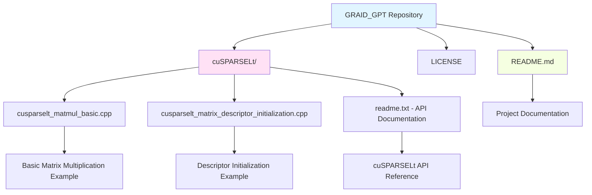
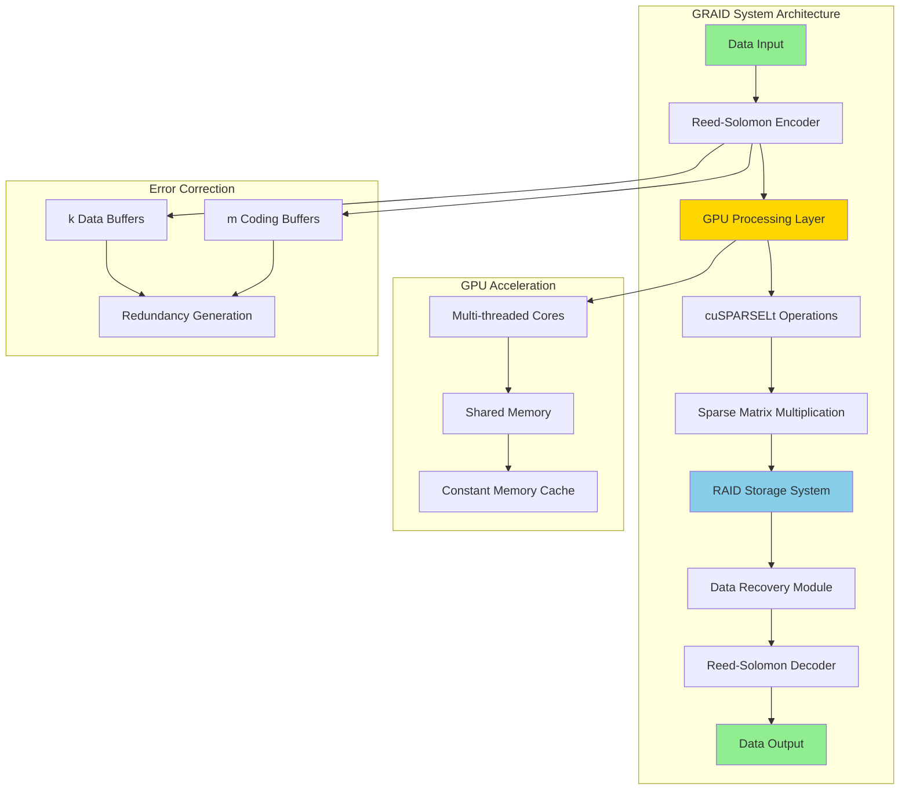
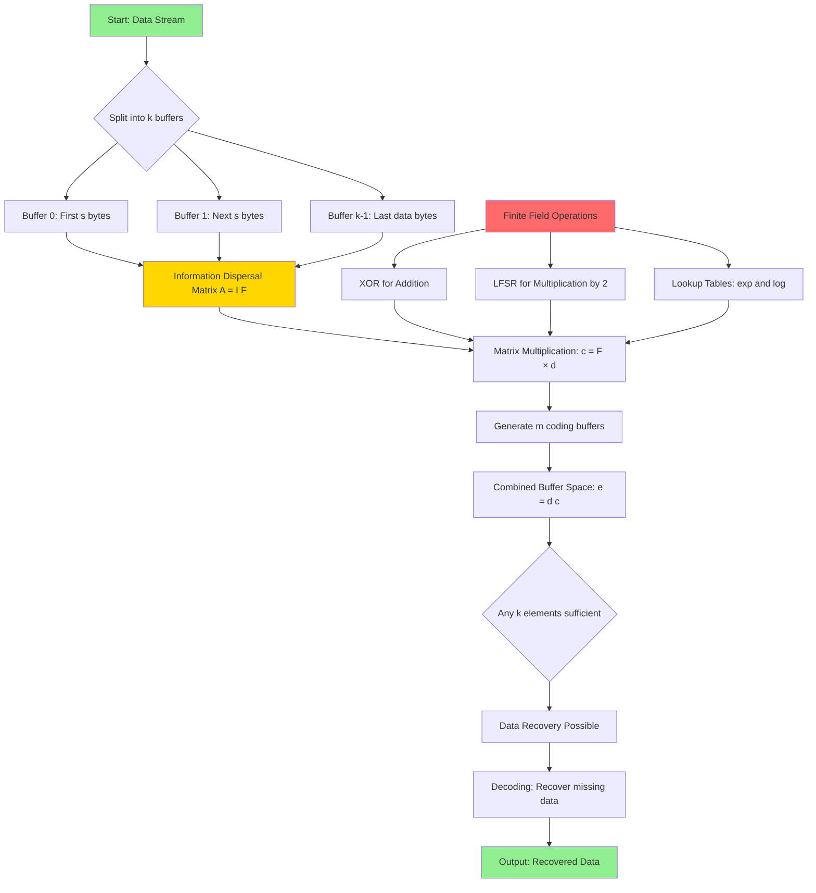
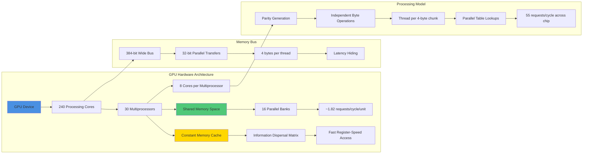
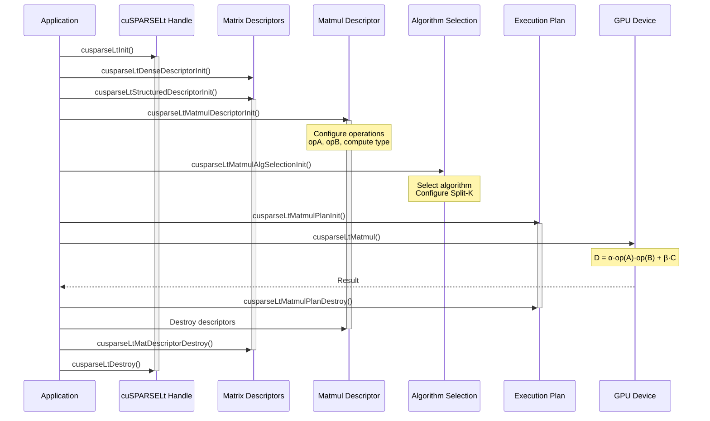
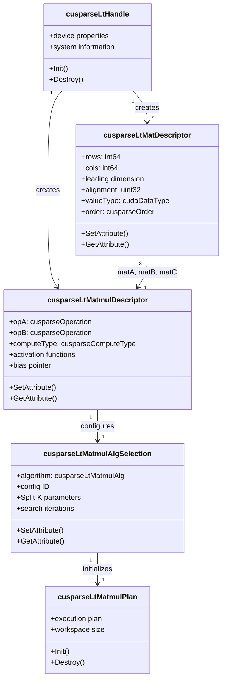
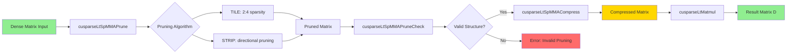
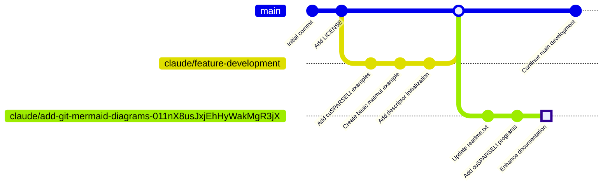

# GRAID_GPT

> GPU-Accelerated RAID with AI-Assisted Development

This repository explores GPU-accelerated RAID (Redundant Array of Independent Disks) implementations using Reed-Solomon coding and NVIDIA's cuSPARSELt library for sparse matrix operations.

## Table of Contents

- [Repository Structure](#repository-structure)
- [Project Architecture](#project-architecture)
- [Reed-Solomon Coding Workflow](#reed-solomon-coding-workflow)
- [GPU Architecture for RAID](#gpu-architecture-for-raid)
- [cuSPARSELt Implementation](#cusparselt-implementation)
- [Git Workflow](#git-workflow)
- [Technical Details](#technical-details)
- [Getting Started](#getting-started)

## Repository Structure



## Project Architecture



## Reed-Solomon Coding Workflow



## GPU Architecture for RAID



## cuSPARSELt Implementation

### Workflow Diagram



### Data Structure Relationships



### Sparse Matrix Operations Pipeline



## Git Workflow



## Technical Details

### Reed-Solomon Coding for RAID

The primary operation in Reed-Solomon coding involves multiplying **F** (the lower m rows of an information dispersal matrix **A = [I F]**) with a vector of data elements **d**. This results in another vector of redundant elements (the coding vector, **c**).

#### Key Properties

- **Redundancy**: Any k elements of **e = [d c]** may be used to recover **d**, even if some (or all) elements of **d** are not available
- **Finite Field Operations**:
  - XOR for addition
  - Linear Feedback Shift Register (LFSR) for multiplication by two
  - Identity: `x × y = exp(log(x) + log(y))` in finite fields of size 2^w

#### Optimization for RAID Systems

For RAID systems with **w = 8** (8 bits per symbol):
- Pre-calculated lookup tables for `exp` and `log` operations (256 bytes each)
- Multiplication implemented with 3 table lookups + addition modulo 2^w - 1
- Significantly faster than traditional logical operations

### Mapping Reed-Solomon Coding to GPUs

#### Buffer Space Organization

```
Buffer Space Layout:
┌─────────────┬─────────────┬───┬─────────────┬─────────────┬───┬─────────────┐
│  Buffer 0   │  Buffer 1   │...│  Buffer k-1 │  Buffer k   │...│ Buffer k+m-1│
│  (Data)     │  (Data)     │   │  (Data)     │  (Coding)   │   │  (Coding)   │
│  s bytes    │  s bytes    │   │  s bytes    │  s bytes    │   │  s bytes    │
└─────────────┴─────────────┴───┴─────────────┴─────────────┴───┴─────────────┘
     ← k data buffers →              ← m coding buffers →
```

- **Buffer**: A specific slice of data of size **s** bytes
- **k**: Number of data buffers
- **m**: Number of coding (redundancy) buffers
- **Buffer Space**: Continuous memory storing all buffers together

#### GPU Architecture Benefits

**NVIDIA GeForce GTX 285 Specifications:**
- 240 processing cores across 30 multiprocessors
- 8 cores per multiprocessor
- 384-bit memory bus for parallel transfers
- Each thread handles 4 bytes per buffer

**Performance Characteristics:**
- Shared memory: 16 parallel banks
- ~4.4 accesses per bank on average for 32 simultaneous threads
- 4 clock cycles per access
- **55 requests per cycle** across the entire chip

**Constant Memory Optimization:**
- Ideal for storing the information dispersal matrix
- Cached at multiprocessor level
- Access speed comparable to registers
- Perfect for lock-step access patterns

## cuSPARSELt Implementation

### Supported Data Types and Compute Modes

| Input Type | Output Type | Compute Type | Description |
|------------|-------------|--------------|-------------|
| CUDA_R_16F | CUDA_R_16F | CUSPARSE_COMPUTE_16F | 16-bit floating-point |
| CUDA_R_16BF | CUDA_R_16BF | CUSPARSE_COMPUTE_16F | 16-bit bfloat |
| CUDA_R_8I | CUDA_R_8I | CUSPARSE_COMPUTE_32I | 8-bit integer |
| CUDA_R_8I | CUDA_R_16F | CUSPARSE_COMPUTE_32I | Mixed precision |
| CUDA_R_32F | CUDA_R_32F | CUSPARSE_COMPUTE_TF32_FAST | TensorFloat-32 (fast) |
| CUDA_R_32F | CUDA_R_32F | CUSPARSE_COMPUTE_TF32 | TensorFloat-32 (accurate) |

### Sparsity Patterns

The library supports **50% sparsity ratio** (CUSPARSELT_SPARSITY_50_PERCENT):
- **2:4 pattern** for half, bfloat16, int8 (2 non-zeros per 4 elements)
- **1:2 pattern** for tf32 and float (1 non-zero per 2 elements)

### Matrix Operation Formula

The cuSPARSELt library computes:

```
D = Activation(α · op(A) · op(B) + β · C + bias) · scale
```

Where:
- **A, B, C**: Input matrices (A or B is structured/sparse)
- **D**: Output matrix
- **α, β**: Scalars or vectors of scalars
- **op()**: Optional transpose operation
- **Activation**: Optional ReLU or GeLU
- **bias**: Optional bias vector
- **scale**: Optional per-channel scaling

## Getting Started

### Prerequisites

- CUDA Toolkit (11.0 or later)
- NVIDIA GPU with Compute Capability 8.0+ (Ampere architecture or newer)
- cuSPARSELt library
- C++14 compatible compiler

### Building the Examples

```bash
# Navigate to cuSPARSELt directory
cd cuSPARSELt

# Compile basic matrix multiplication example
nvcc -lcusparseLt cusparselt_matmul_basic.cpp -o matmul_basic

# Compile descriptor initialization example
nvcc -lcusparseLt cusparselt_matrix_descriptor_initialization.cpp -o descriptor_init

# Run examples
./matmul_basic
./descriptor_init
```

### Example Usage

See the example programs in the `cuSPARSELt/` directory:

1. **cusparselt_matmul_basic.cpp**: Demonstrates the complete workflow for sparse matrix multiplication
2. **cusparselt_matrix_descriptor_initialization.cpp**: Shows how to initialize and configure matrix descriptors

## Project Roadmap

- [x] Basic cuSPARSELt examples
- [x] Documentation with mermaid diagrams
- [ ] Performance benchmarks
- [ ] Integration with actual RAID systems
- [ ] Python bindings
- [ ] Comparative analysis with CPU implementations

## Contributing

Contributions are welcome! Please ensure:

1. Code follows CUDA best practices
2. Examples are well-documented
3. Performance implications are noted
4. Tests are included where applicable

## References

- [NVIDIA cuSPARSELt Documentation](https://docs.nvidia.com/cuda/cusparselt/)
- Reed-Solomon coding for RAID systems
- GPU architecture optimization techniques

## License

See [LICENSE](LICENSE) file for details.

---

**Note**: This project combines theoretical concepts of Reed-Solomon coding with practical GPU implementations using NVIDIA's cuSPARSELt library for high-performance RAID systems.
