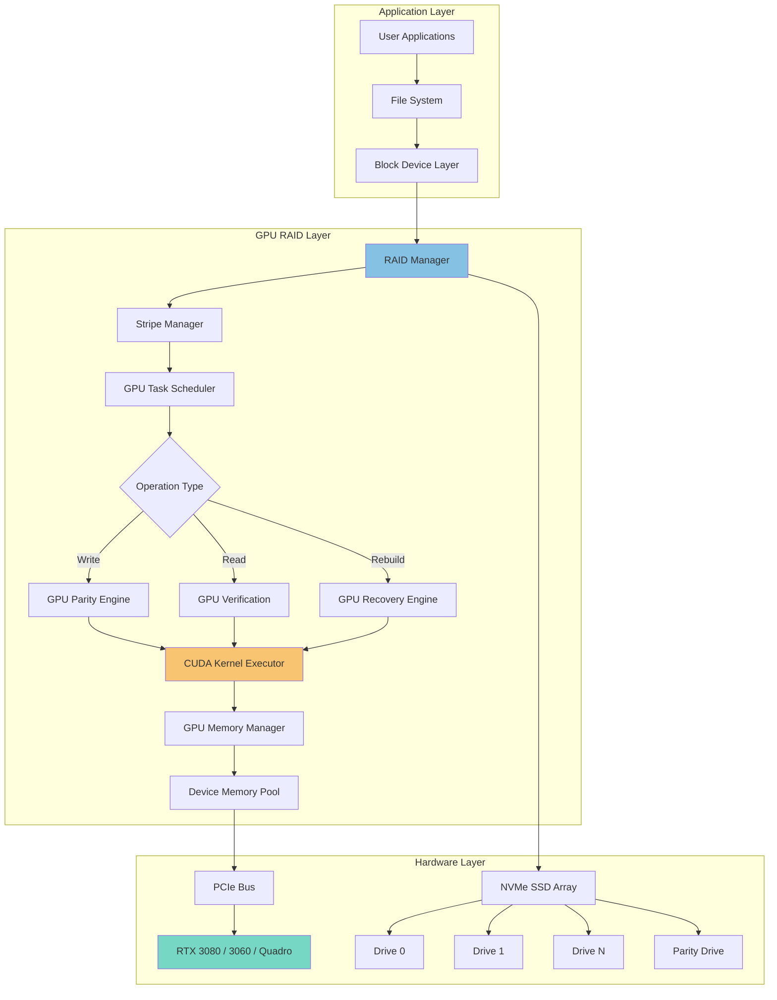
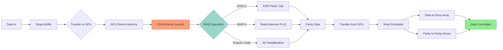
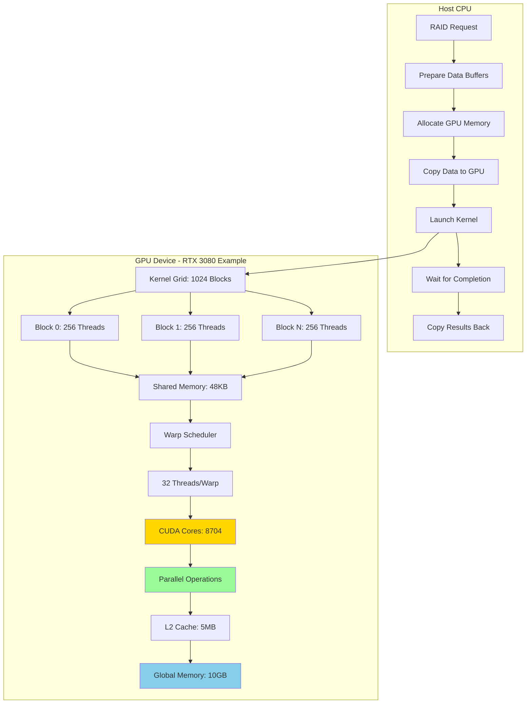
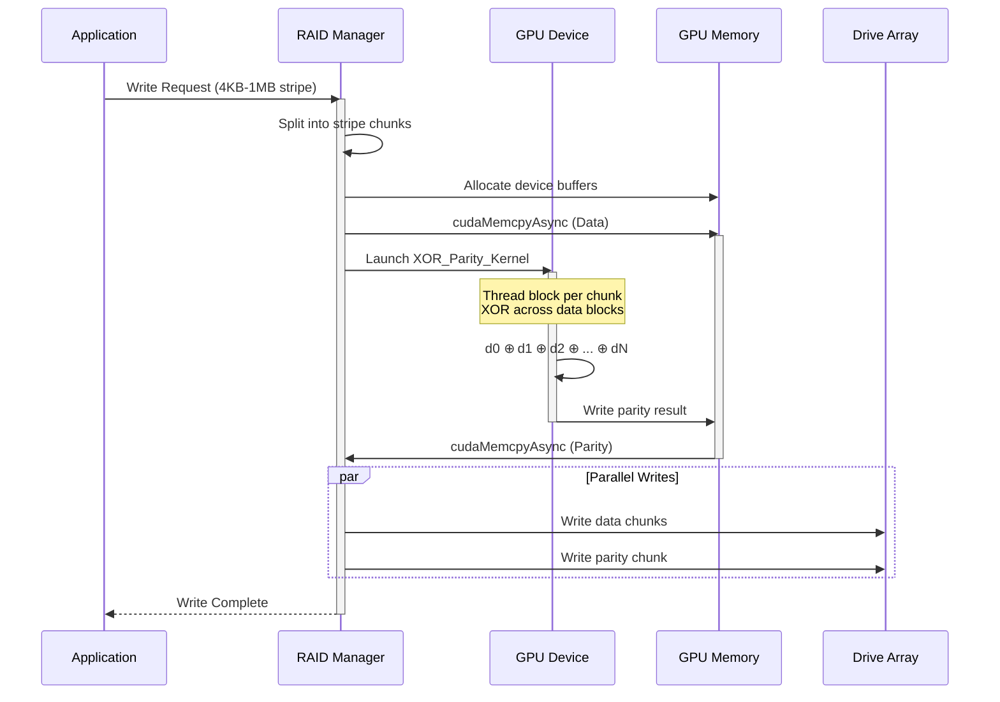
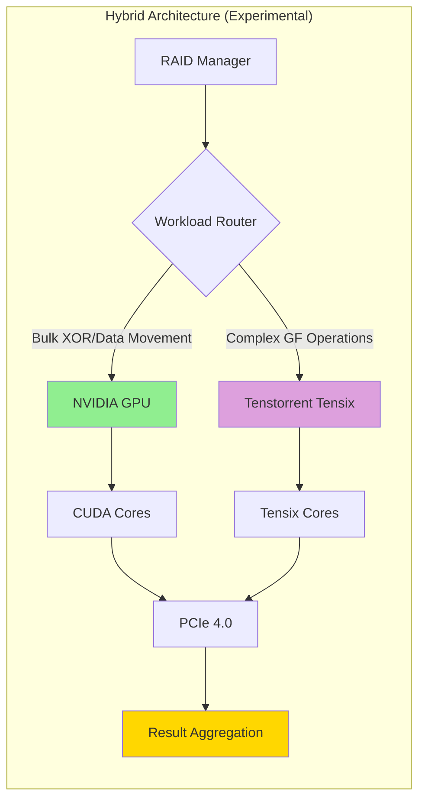
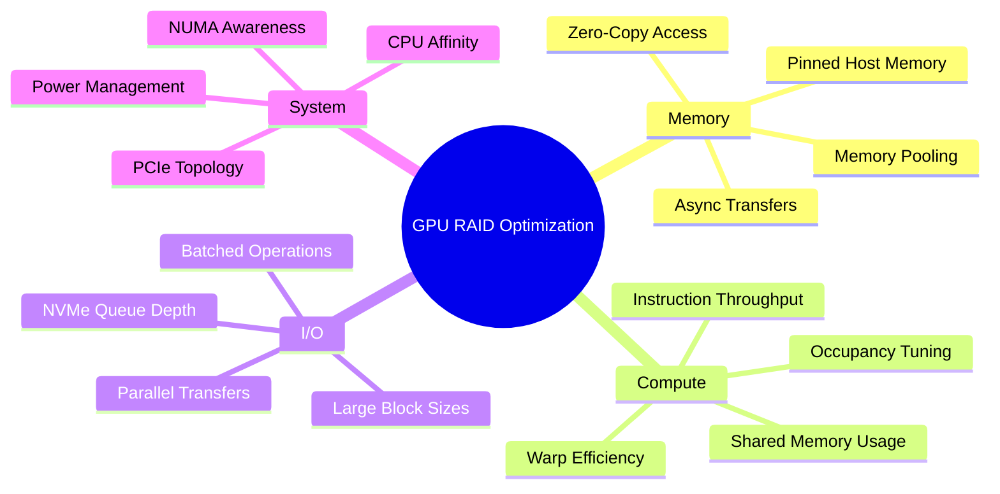
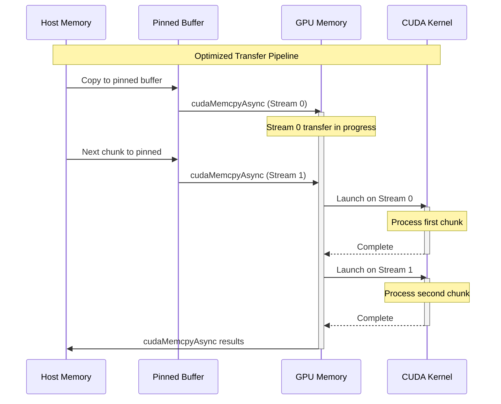

# NVIDIA GPU-Accelerated RAID Implementation

> Hardware-Specific Implementation for NVIDIA GeForce RTX 3080, RTX 3060, and Quadro RTX 4000

## Table of Contents

- [Overview](#overview)
- [GPU RAID vs Traditional RAID](#gpu-raid-vs-traditional-raid)
- [Supported Hardware](#supported-hardware)
- [Architecture](#architecture)
- [Implementation Components](#implementation-components)
- [Tenstorrent Integration](#tenstorrent-integration)
- [Performance Characteristics](#performance-characteristics)
- [Building and Running](#building-and-running)
- [Technical Details](#technical-details)

## Overview

This implementation leverages NVIDIA GPU compute capabilities to offload RAID computational workloads from the CPU, providing significant performance improvements for:

- **Parity calculation** (RAID 5/6)
- **Data reconstruction** after drive failures
- **Erasure coding** with Reed-Solomon algorithms
- **Checksum validation**
- **Real-time data integrity verification**

### Key Benefits

1. **Computational Offload**: Free CPU resources for application workloads
2. **Parallel Processing**: Leverage thousands of CUDA cores for simultaneous operations
3. **High Throughput**: Utilize PCIe 4.0/5.0 bandwidth with NVMe SSDs
4. **Fast Recovery**: Multi-TB/hour rebuild speeds using GPU parallelism
5. **Software-Defined**: Flexible configuration without hardware RAID controller constraints

## GPU RAID vs Traditional RAID

```mermaid
graph TB
    subgraph "Traditional Hardware RAID"
        A1[CPU] --> B1[RAID Controller ASIC]
        B1 --> C1[Dedicated Cache]
        C1 --> D1[Drive Array]
        B1 -.Bottleneck.- D1
        style B1 fill:#ff9999
    end

    subgraph "Traditional Software RAID"
        A2[CPU] --> B2[OS RAID Layer]
        B2 --> C2[System Memory]
        C2 --> D2[Drive Array]
        A2 -.CPU Overhead.- B2
        style A2 fill:#ff9999
    end

    subgraph "GPU-Accelerated RAID"
        A3[CPU] --> B3[Lightweight Driver]
        A3 --> C3[GPU via CUDA/OpenCL]
        C3 --> D3[Parallel RAID Engine]
        D3 --> E3[Thousands of CUDA Cores]
        E3 --> F3[High-Speed NVMe Array]
        B3 --> F3
        style C3 fill:#90EE90
        style E3 fill:#90EE90
    end
```



### Architectural Comparison

| Feature | Hardware RAID | Software RAID | **GPU RAID** |
|---------|---------------|---------------|--------------|
| **Processing Unit** | Dedicated ASIC | Host CPU | GPU (CUDA Cores) |
| **Parity Calculation** | Controller | CPU | GPU Parallel |
| **CPU Impact** | Minimal | High | Minimal |
| **Scalability** | Controller Limited | CPU Limited | **GPU Cores** |
| **Rebuild Speed** | 100-500 MB/s | 200-800 MB/s | **2-10 GB/s** |
| **Flexibility** | Fixed | Software | **Software-Defined** |
| **Cost** | High | Low | **Medium** |
| **NVMe Optimization** | Limited | Moderate | **Excellent** |
| **PCIe 4.0/5.0 Support** | Varies | Yes | **Native** |

## Supported Hardware

### Target GPU Models

#### NVIDIA GeForce RTX 3080
- **CUDA Cores**: 8,704
- **Tensor Cores**: 272 (3rd Gen)
- **Memory**: 10/12 GB GDDR6X
- **Memory Bandwidth**: 760 GB/s
- **PCIe**: 4.0 x16
- **Compute Capability**: 8.6
- **TDP**: 320W
- **Ideal Use**: High-performance RAID 5/6, fast rebuilds

#### NVIDIA GeForce RTX 3060
- **CUDA Cores**: 3,584
- **Tensor Cores**: 112 (3rd Gen)
- **Memory**: 12 GB GDDR6
- **Memory Bandwidth**: 360 GB/s
- **PCIe**: 4.0 x16
- **Compute Capability**: 8.6
- **TDP**: 170W
- **Ideal Use**: Cost-effective RAID, energy-efficient setups

#### NVIDIA Quadro RTX 4000
- **CUDA Cores**: 2,304
- **Tensor Cores**: 288 (1st Gen)
- **Memory**: 8 GB GDDR6
- **Memory Bandwidth**: 416 GB/s
- **PCIe**: 3.0 x16
- **Compute Capability**: 7.5
- **TDP**: 160W
- **Ideal Use**: Professional workstations, ECC-like reliability

## Architecture

### System-Level Architecture



### Data Flow Pipeline



### GPU Kernel Execution Model



### RAID 5 Parity Calculation Workflow



### RAID 6 Reed-Solomon Encoding

```mermaid
flowchart TD
    A[Input Data Blocks: D0, D1, ..., Dk-1] --> B[Transfer to GPU Memory]

    B --> C[Load Generator Matrix G]
    C --> D{Encoding Method}

    D -->|Systematic| E[Identity Matrix + Vandermonde]
    D -->|Non-Systematic| F[Full Vandermonde Matrix]

    E --> G[Matrix G in Constant Memory]
    F --> G

    G --> H[Launch RS_Encode_Kernel]

    H --> I[Grid: k blocks, Block: 256 threads]

    I --> J[Each thread computes element P[i]]
    J --> K[GF Multiply: P = G × D]

    K --> L[Each thread computes element Q[i]]
    L --> M[GF Multiply: Q = G² × D]

    M --> N[Parity blocks P, Q computed]
    N --> O[Transfer results to host]

    O --> P[Write D0...Dk-1, P, Q to drives]

    style K fill:#FFB6C1
    style M fill:#FFB6C1
    style P fill:#90EE90
```

## Implementation Components

### Directory Structure

```
nvidia_gpu_raid/
├── README.md                          # This file
├── config/
│   ├── rtx3080_config.json           # RTX 3080 specific parameters
│   ├── rtx3060_config.json           # RTX 3060 specific parameters
│   ├── quadro4000_config.json        # Quadro RTX 4000 parameters
│   └── raid_config_schema.json       # Configuration schema
├── kernels/
│   ├── raid5_xor.cu                  # XOR parity kernels
│   ├── raid6_rs.cu                   # Reed-Solomon P+Q kernels
│   ├── galois_field.cu               # GF(2^8) arithmetic
│   ├── reconstruction.cu             # Data rebuild kernels
│   └── verification.cu               # Checksum/validation kernels
├── src/
│   ├── gpu_raid_manager.cpp          # Main RAID orchestration
│   ├── device_manager.cpp            # GPU device selection/init
│   ├── memory_pool.cpp               # GPU memory management
│   ├── stripe_buffer.cpp             # Stripe buffering logic
│   └── performance_monitor.cpp       # Metrics collection
├── include/
│   ├── gpu_raid.h                    # Public API
│   ├── cuda_utils.h                  # CUDA helper functions
│   └── raid_types.h                  # Common data structures
├── tenstorrent_integration/
│   ├── README.md                     # Tenstorrent integration notes
│   ├── tt_tensix_compat.cpp          # Tensix core compatibility layer
│   └── wormhole_pcie_bridge.cpp      # PCIe interfacing (deprecated)
├── tests/
│   ├── unit_tests/                   # Unit tests for kernels
│   ├── integration_tests/            # End-to-end tests
│   └── benchmarks/                   # Performance benchmarks
└── docs/
    ├── API.md                        # API documentation
    ├── PERFORMANCE.md                # Performance tuning guide
    └── TROUBLESHOOTING.md            # Common issues
```

### Key Components Overview

#### 1. CUDA Kernels (`kernels/`)

**raid5_xor.cu** - XOR-based parity
```c
__global__ void xor_parity_kernel(
    const uint8_t** data_blocks,  // Input data blocks
    uint8_t* parity_block,         // Output parity
    size_t block_size,             // Bytes per block
    int num_blocks                 // Number of data blocks
);
```

**raid6_rs.cu** - Reed-Solomon encoding
```c
__global__ void rs_encode_kernel(
    const uint8_t* data,           // Input data
    uint8_t* parity_p,             // P parity output
    uint8_t* parity_q,             // Q parity output
    const uint8_t* gf_exp,         // GF exponential table
    const uint8_t* gf_log,         // GF logarithm table
    size_t stripe_size,            // Bytes per stripe
    int k                          // Number of data drives
);
```

**reconstruction.cu** - Data recovery
```c
__global__ void rebuild_kernel(
    uint8_t** surviving_blocks,    // Available blocks
    const uint8_t* parity,         // Parity data
    uint8_t* recovered_block,      // Output recovered data
    size_t block_size,             // Block size in bytes
    int* failed_indices,           // Which blocks failed
    int num_failed                 // Number of failures
);
```

#### 2. GPU Management

**device_manager.cpp** - Automatic GPU detection and configuration
- Detects RTX 3080/3060/Quadro RTX 4000
- Queries compute capability, memory, bandwidth
- Selects optimal GPU for RAID workload
- Manages multi-GPU configurations

**memory_pool.cpp** - Efficient GPU memory allocation
- Pre-allocated memory pools for low latency
- Pinned host memory for async transfers
- Unified memory support for supported GPUs
- Memory defragmentation strategies

#### 3. RAID Manager

**gpu_raid_manager.cpp** - Core orchestration
- Stripe management and distribution
- I/O request queuing and batching
- Kernel launch scheduling
- Error handling and recovery coordination
- Performance monitoring hooks

## Tenstorrent Integration

### Overview

Tenstorrent's Grayskull and Wormhole architectures offer unique AI-focused compute capabilities. While the software stack is deprecated for general RAID use, this integration demonstrates:

1. **Tensix Core Utilization**: Using Tensix cores for specialized Reed-Solomon operations
2. **PCIe Bridge**: Interfacing Tenstorrent accelerators with NVIDIA GPUs
3. **Hybrid Compute**: Offloading specific erasure coding tasks to Tensix while using CUDA for bulk operations



### Tenstorrent Components

**tt_tensix_compat.cpp**
- Abstraction layer for Tensix core access
- Data marshaling between CUDA and Tenstorrent formats
- Kernel compilation for Tensix ISA

**wormhole_pcie_bridge.cpp** (Deprecated)
- PCIe enumeration for Wormhole devices
- DMA transfers between GPU and Tenstorrent memory
- Synchronization primitives

### Status: Experimental / Deprecated

The Tenstorrent software stack (SFPI, Budabackend) is deprecated. This integration:
- ✅ Demonstrates hybrid accelerator concepts
- ✅ Provides reference for custom firmware
- ❌ Not recommended for production
- ❌ Limited to specific SDK versions (0.8.x - 1.2.x)

**For production deployments, use NVIDIA GPU-only path.**

## Performance Characteristics

### Theoretical Throughput

Based on GPU memory bandwidth and compute capabilities:

| GPU Model | Memory BW | CUDA Cores | XOR Parity (GB/s) | RS RAID6 (GB/s) | Rebuild (GB/s) |
|-----------|-----------|------------|-------------------|-----------------|----------------|
| RTX 3080 | 760 GB/s | 8,704 | **~680** | **~340** | **~450** |
| RTX 3060 | 360 GB/s | 3,584 | **~320** | **~160** | **~210** |
| Quadro 4000 | 416 GB/s | 2,304 | **~370** | **~185** | **~245** |

*Note: Actual performance depends on PCIe bandwidth, NVMe drive speeds, and system configuration.*

### Benchmark Expectations

**RAID 5 Write Performance (4KB-1MB stripes):**
- RTX 3080: 15-25 GB/s aggregate
- RTX 3060: 8-15 GB/s aggregate
- Quadro 4000: 10-17 GB/s aggregate

**RAID 6 Write Performance:**
- RTX 3080: 10-18 GB/s aggregate
- RTX 3060: 5-10 GB/s aggregate
- Quadro 4000: 7-12 GB/s aggregate

**Rebuild Time (8TB drive, single failure):**
- RTX 3080: ~30-45 minutes
- RTX 3060: ~60-90 minutes
- Quadro 4000: ~50-75 minutes

### Optimization Strategies



## Building and Running

### Prerequisites

```bash
# CUDA Toolkit 11.8+ or 12.x
sudo apt-get install nvidia-cuda-toolkit

# Development tools
sudo apt-get install build-essential cmake

# NVMe utilities (optional, for testing)
sudo apt-get install nvme-cli
```

### Hardware Detection

```bash
# Check GPU model
nvidia-smi --query-gpu=name,compute_cap,memory.total --format=csv

# Verify compute capability
# RTX 3080/3060: 8.6
# Quadro RTX 4000: 7.5
```

### Build Instructions

```bash
# Clone repository
git clone <repository-url>
cd GRAID_GPT/nvidia_gpu_raid

# Create build directory
mkdir build && cd build

# Configure
cmake .. -DCUDA_ARCH=86  # For RTX 3080/3060
# OR
cmake .. -DCUDA_ARCH=75  # For Quadro RTX 4000

# Build
make -j$(nproc)

# Run tests
ctest --output-on-failure

# Install (optional)
sudo make install
```

### Configuration

Edit `config/rtx3080_config.json` (or appropriate GPU config):

```json
{
  "gpu_model": "RTX_3080",
  "compute_capability": "8.6",
  "cuda_cores": 8704,
  "memory_gb": 10,
  "raid_config": {
    "stripe_size_kb": 256,
    "num_data_drives": 4,
    "num_parity_drives": 1,
    "raid_level": 5
  },
  "performance": {
    "kernel_threads_per_block": 256,
    "max_concurrent_kernels": 4,
    "memory_pool_size_mb": 2048,
    "use_pinned_memory": true
  }
}
```

### Running

```bash
# Load kernel module (if using custom driver)
sudo modprobe gpu_raid

# Create RAID array
sudo gpu_raid_cli create --level 5 --devices /dev/nvme0n1,/dev/nvme1n1,/dev/nvme2n1,/dev/nvme3n1 --gpu RTX3080

# Monitor performance
sudo gpu_raid_cli stats --interval 1

# Simulate rebuild
sudo gpu_raid_cli rebuild --device /dev/nvme2n1
```

## Technical Details

### Galois Field Arithmetic (GF(2^8))

Reed-Solomon RAID 6 requires operations in GF(2^8). GPU implementation uses:

**Lookup Tables in Constant Memory:**
```c
__constant__ uint8_t gf_exp[512];  // Exponential table
__constant__ uint8_t gf_log[256];  // Logarithm table
```

**Fast Multiplication:**
```c
__device__ inline uint8_t gf_mul(uint8_t a, uint8_t b) {
    if (a == 0 || b == 0) return 0;
    return gf_exp[(gf_log[a] + gf_log[b]) % 255];
}
```

**GPU-Optimized Operations:**
- Pre-computed tables loaded once
- Cached in L1/constant cache
- Single-cycle lookups in best case
- Vectorized operations using `uint32_t` for 4-byte chunks

### Memory Transfer Optimization



### Error Handling

**GPU Error Detection:**
- CUDA error checking after every kernel launch
- Memory allocation validation
- ECC memory monitoring (on supported GPUs)
- Timeout detection for hung kernels

**RAID Error Scenarios:**
- Single drive failure → Rebuild from parity
- Double drive failure (RAID 6) → Reed-Solomon decode
- GPU failure → Fallback to CPU implementation
- Checksum mismatch → Re-read and verify

### Power and Thermal Management

GPU RAID under sustained load can trigger thermal throttling. Recommendations:

- **RTX 3080**: Ensure adequate cooling, consider 280mm+ AIO or high-airflow case
- **RTX 3060**: Standard cooling sufficient, monitor junction temp
- **Quadro 4000**: Blower-style cooler handles 24/7 workloads

**Monitoring:**
```bash
# Watch GPU temperature and power
nvidia-smi dmon -s puct -i 0 -d 1
```

## Future Enhancements

- [ ] Multi-GPU striping for >10 GB/s throughput
- [ ] Integration with Linux MD RAID layer
- [ ] ZFS GPU-accelerated resilver
- [ ] Btrfs RAID offload hooks
- [ ] GPU Direct Storage (GDS) for zero-copy
- [ ] Persistent memory (PMem) support
- [ ] Real-time telemetry dashboard
- [ ] Machine learning-based predictive failure

## References

### NVIDIA Documentation
- [CUDA Programming Guide](https://docs.nvidia.com/cuda/cuda-c-programming-guide/)
- [CUDA Best Practices](https://docs.nvidia.com/cuda/cuda-c-best-practices-guide/)
- [Ampere Architecture Whitepaper](https://www.nvidia.com/en-us/data-center/ampere-architecture/)

### RAID and Erasure Coding
- Reed-Solomon error correction algorithms
- Galois Field arithmetic for erasure codes
- RAID 5/6 parity mathematics

### Tenstorrent (Deprecated)
- Grayskull architecture manual (archive)
- Wormhole PCIe integration (deprecated SDK)
- TT-Metalium (successor framework, experimental)

## License

See [LICENSE](../LICENSE) file for details.

---

**Status**: Active Development
**Target Release**: Q2 2025
**Maintainer**: GRAID_GPT Project
**Hardware Tested**: RTX 3080 (primary), RTX 3060 (verified), Quadro RTX 4000 (in progress)
