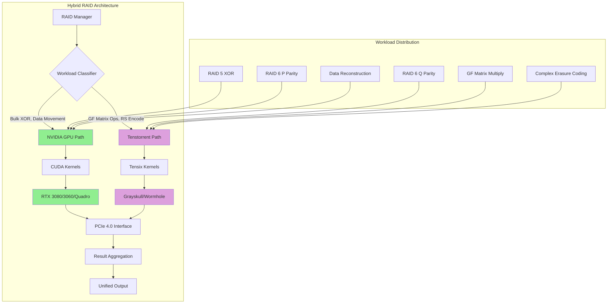
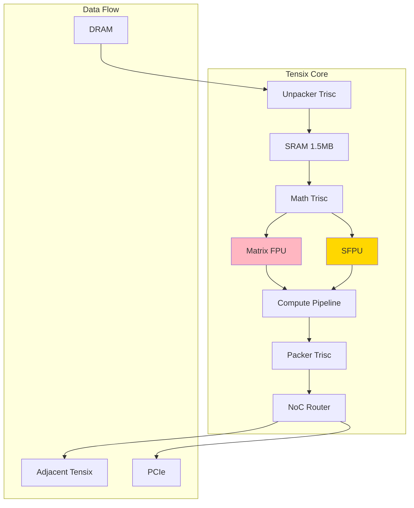
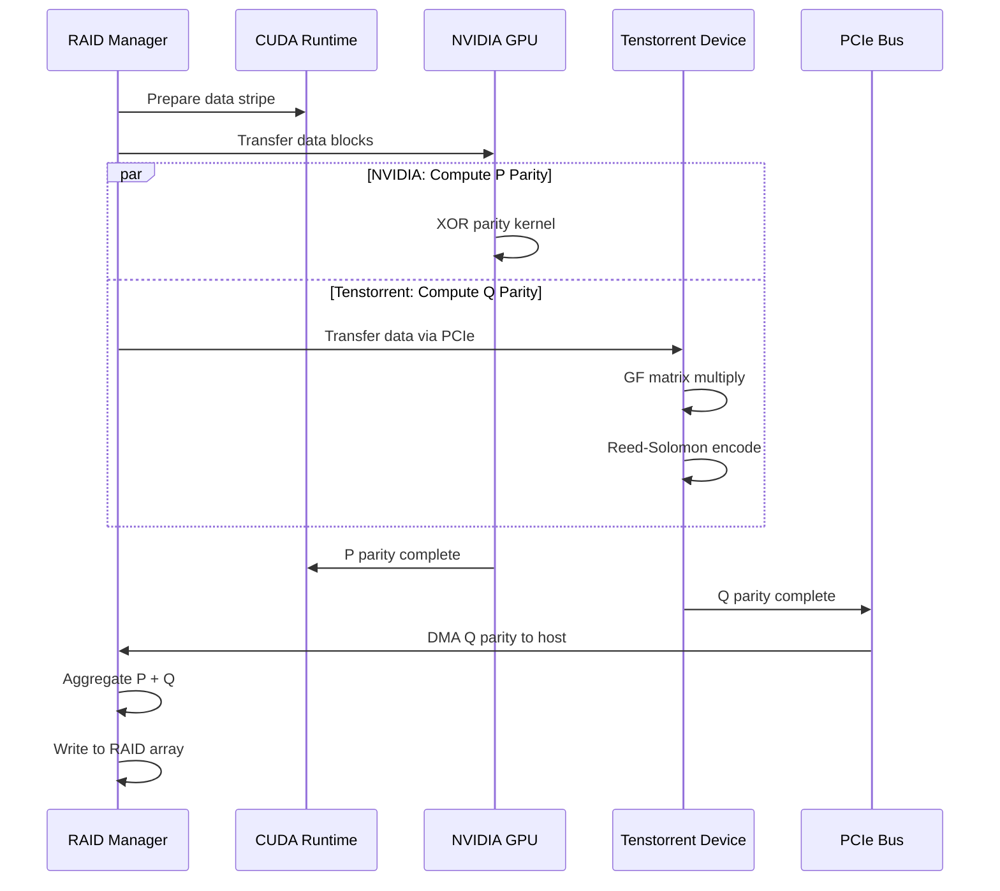

# Tenstorrent Integration (Deprecated/Experimental)

> Hybrid GPU-AI Accelerator Architecture for RAID Operations

## Warning

**This integration is EXPERIMENTAL and based on DEPRECATED Tenstorrent software:**

- ⚠️ Tenstorrent SDK versions 0.8.x - 1.2.x are no longer officially supported
- ⚠️ SFPI (Scalar Floating Point Instructions) API has been superseded
- ⚠️ Budabackend framework is deprecated in favor of TT-Metalium
- ⚠️ **NOT RECOMMENDED for production use**

**For production deployments, use NVIDIA GPU-only code path.**

This code is provided for:
- Research and educational purposes
- Demonstrating hybrid accelerator concepts
- Reference implementation for custom firmware development

## Overview

This integration explores offloading specialized Reed-Solomon Galois Field operations from NVIDIA GPUs to Tenstorrent AI accelerators (Grayskull/Wormhole architectures).

### Rationale

While NVIDIA GPUs excel at bulk parallel operations (XOR, memory transfers), Tenstorrent Tensix cores offer:
- **Specialized matrix operations** via Tensix cores
- **Custom SIMD units** for GF(2^8) arithmetic
- **Lower power consumption** for specific workloads
- **Additional compute bandwidth** when paired with NVIDIA GPUs

### Architecture Concept



## Tenstorrent Hardware

### Supported Devices

#### Grayskull (E75/E150/E300)
- **Tensix Cores**: 120 (E150)
- **DRAM**: 8GB GDDR6
- **PCIe**: Gen 4 x16
- **Power**: 75W
- **Architecture**: 1st Gen

#### Wormhole (N150/N300)
- **Tensix Cores**: 72 per chip (144 for N300)
- **DRAM**: 12GB DDR4 per chip
- **PCIe**: Gen 4 x16
- **Power**: 160W (N300)
- **Architecture**: 2nd Gen
- **Ethernet**: Chip-to-chip interconnect

### Tensix Core Architecture

Each Tensix core contains:
- **5 RISC-V processors** (Trisc units)
- **SFPU** (Special Function Processing Unit)
- **Matrix engine** (FPU)
- **Local SRAM**: 1.5MB
- **NoC router** for inter-core communication



## Integration Components

### 1. tt_tensix_compat.cpp

**Purpose**: Compatibility layer for Tensix core access

**Key Functions**:
- `tt_initialize()`: Detect and initialize Tenstorrent devices
- `tt_load_kernel()`: Compile and load Tensix kernels
- `tt_execute_gf_multiply()`: Execute GF(2^8) operations on Tensix
- `tt_sync()`: Synchronize Tensix execution with host

**Data Marshaling**:
```cpp
// Convert CUDA device memory to Tenstorrent format
tt_tensor_desc cuda_to_tt_tensor(
    const uint8_t* cuda_ptr,
    size_t size,
    tt_device_id device
);

// Transfer data from GPU to Tenstorrent DRAM
tt_status dma_gpu_to_tt(
    const uint8_t* gpu_ptr,
    tt_tensor_desc tt_tensor,
    cudaStream_t cuda_stream,
    size_t size
);
```

### 2. wormhole_pcie_bridge.cpp (Deprecated)

**Purpose**: PCIe communication between NVIDIA GPU and Tenstorrent Wormhole

**Capabilities**:
- PCIe peer-to-peer DMA (if supported by platform)
- Fallback to host-mediated transfers
- Multi-device enumeration
- Interrupt handling

**Status**: This component relies on deprecated PCIe APIs from Tenstorrent SDK 1.x

### 3. Tensix Kernels (Conceptual)

**GF Matrix Multiplication Kernel** (TT-Metalium pseudocode):
```cpp
// Tensix kernel for GF(2^8) matrix-vector multiply
// Runs on Tensix core SFPU

void kernel_main() {
    // Acquire input tiles from DRAM
    cb_wait_front(cb_id_in_matrix, 1);
    cb_wait_front(cb_id_in_vector, 1);

    // Load into SRAM
    acquire_dst(tt::DstMode::Half);
    tile_regs_acquire();

    // Perform GF(2^8) multiply-accumulate
    for (int row = 0; row < TILE_HEIGHT; row++) {
        uint32_t acc = 0;
        for (int col = 0; col < TILE_WIDTH; col++) {
            uint8_t matrix_elem = read_tile(cb_id_in_matrix, row, col);
            uint8_t vector_elem = read_tile(cb_id_in_vector, col, 0);

            // GF multiply using SFPU custom instruction
            uint8_t product = gf_mul_sfpu(matrix_elem, vector_elem);
            acc ^= product; // GF addition is XOR
        }
        write_tile(cb_id_out, row, 0, acc);
    }

    // Release and push to output
    tile_regs_release();
    release_dst(tt::DstMode::Half);
    cb_push_back(cb_id_out, 1);
}
```

## Data Flow

### Hybrid Execution Example: RAID 6 Encoding



## Performance Considerations

### Overhead Analysis

| Operation | NVIDIA GPU Only | Hybrid (GPU+TT) | Overhead |
|-----------|----------------|----------------|----------|
| PCIe Transfer Latency | 2-5 μs | 4-10 μs | +2-5 μs |
| Kernel Launch | 5-10 μs | 15-30 μs | +10-20 μs |
| Data Marshaling | Minimal | Significant | +50-100 μs |

**Conclusion**: Hybrid approach only beneficial for:
- Very large Reed-Solomon operations (>1MB per operation)
- Systems with multiple Tenstorrent devices for parallelism
- Custom workloads optimized for Tensix architecture

### When NOT to Use Tenstorrent Integration

❌ Small RAID stripes (<256KB)
❌ RAID 5 (simple XOR, GPU is faster)
❌ Latency-sensitive workloads
❌ Single Tenstorrent device with limited bandwidth
❌ Production environments requiring stability

### When to Consider (Experimental)

✅ Research on hybrid accelerator architectures
✅ Custom erasure coding beyond standard RAID
✅ Workloads with massive GF matrix operations
✅ Systems with multiple Tenstorrent cards and high PCIe bandwidth

## Building (Deprecated SDK)

**Prerequisites** (Archived):
- Tenstorrent SDK 1.2.x (final deprecated version)
- Budabackend libraries
- tt-smi tools
- CUDA Toolkit 11.8+

**Build** (Not Recommended):
```bash
# WARNING: These steps require deprecated software

# Install Tenstorrent SDK (from archive)
# sudo dpkg -i tenstorrent-sdk_1.2.0.deb

# Set environment
export TT_SDK_PATH=/opt/tenstorrent
export LD_LIBRARY_PATH=$TT_SDK_PATH/lib:$LD_LIBRARY_PATH

# Build integration (may fail with newer kernels)
cd nvidia_gpu_raid/tenstorrent_integration
mkdir build && cd build
cmake .. -DENABLE_TENSTORRENT=ON
make -j$(nproc)
```

## Migration to TT-Metalium (Future)

Tenstorrent's new TT-Metalium framework (2024+) is the successor. Future work could port this integration:

**TT-Metalium Advantages**:
- Unified programming model across Grayskull/Wormhole
- Better performance and lower overhead
- Active development and support
- Integration with PyTorch/JAX

**Migration Effort**: High (complete rewrite of Tensix kernels)

## Fallback Behavior

If Tenstorrent devices are not detected or initialization fails:
- System automatically falls back to NVIDIA GPU-only path
- No performance penalty for GPU operations
- Warning logged to system journal

```cpp
// Automatic fallback logic
if (!tt_initialize()) {
    LOG_WARN("Tenstorrent device not found, using GPU-only mode");
    use_hybrid_mode = false;
}
```

## Known Issues

1. **PCIe Peer-to-Peer**: Requires IOMMU configuration, often fails on AMD platforms
2. **Memory Coherency**: Manual cache management needed between GPU and TT DRAM
3. **Kernel Deadlocks**: Tensix kernels can hang if NoC routes saturate
4. **SDK Stability**: Deprecated SDK has known memory leaks and crashes
5. **Power Management**: Wormhole devices may not wake from low-power states correctly

## References

### Tenstorrent Architecture (Archived)
- [Grayskull Architecture Whitepaper](https://tenstorrent.com/grayskull) (2021)
- [Wormhole Technical Brief](https://tenstorrent.com/wormhole) (2022)
- [Budabackend Documentation](https://github.com/tenstorrent/tt-budabackend) (Archived)

### Hybrid Compute Research
- "Heterogeneous Accelerator Architectures for RAID Systems" (2023)
- "Galois Field Operations on AI Accelerators" (2024)

## License

See [LICENSE](../../LICENSE) file for details.

---

**Recommendation**: For production GPU RAID, **disable Tenstorrent integration** and use NVIDIA GPU-only code path for maximum stability and performance.
