# Tenstorrent Greyskull Hardware Support

> GRAID_GPT Implementation for Tenstorrent Grayskull e75 and e150 RISC-V AI Accelerators

This directory contains hardware-specific implementations for Tenstorrent's Grayskull e75 and e150 PCIe AI accelerator cards, enabling GPU-accelerated RAID operations using RISC-V based tensor processors.

## Table of Contents

- [Hardware Overview](#hardware-overview)
- [Architecture](#architecture)
- [Software Stack](#software-stack)
- [System Integration](#system-integration)
- [Memory Architecture](#memory-architecture)
- [RAID Implementation](#raid-implementation)
- [Getting Started](#getting-started)
- [Examples](#examples)
- [Important Notes](#important-notes)

## Hardware Overview

### Grayskull e75

| Specification | Value |
|--------------|-------|
| Tensix Cores | 96 @ 1.0 GHz |
| On-Chip SRAM | 96 MB (1 MB per core) |
| External Memory | 8 GB LPDDR4 |
| Memory Bandwidth | 102.4 GB/s |
| Peak Performance (FP8) | 221 TeraFLOPS |
| Peak Performance (FP16) | 55 TeraFLOPS |
| Power Consumption | 75W TDP |
| Form Factor | Single-slot, low-profile |
| Interface | PCIe Gen 4.0 x16 |
| Price | $599 USD |

### Grayskull e150

| Specification | Value |
|--------------|-------|
| Tensix Cores | 120 @ 1.2 GHz |
| On-Chip SRAM | 120 MB (1 MB per core) |
| External Memory | 8 GB LPDDR4 |
| Memory Bandwidth | 118.4 GB/s |
| Peak Performance (FP8) | 332 TeraFLOPS |
| Peak Performance (FP16) | 83 TeraFLOPS |
| Power Consumption | 200W TDP |
| Form Factor | Dual-slot, full-height |
| Interface | PCIe Gen 4.0 x16 |
| Price | $799 USD |

### Supported Data Types

- **Floating Point**: FP8, FP16, BFLOAT16
- **Block Floating Point**: BLOCKFP2, BLOCKFP4, BLOCKFP8
- **Vector**: VTF19

## Architecture

### Tensix Core Architecture

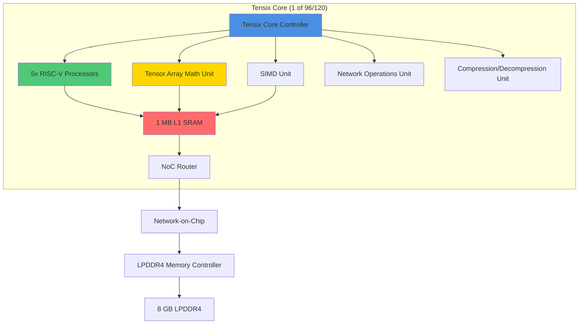

### Grayskull System Architecture

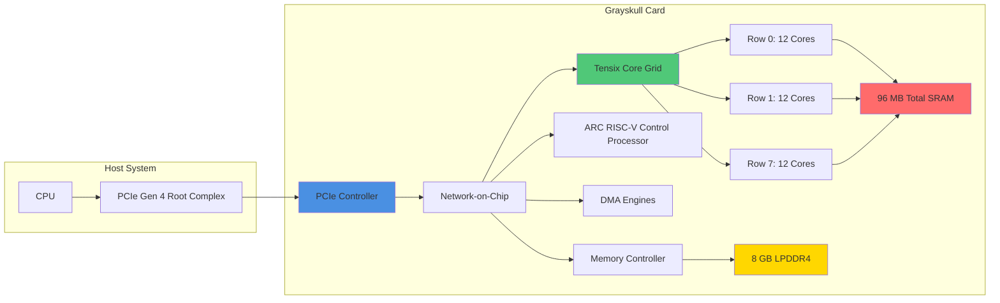

### Tensix Core Grid Layout

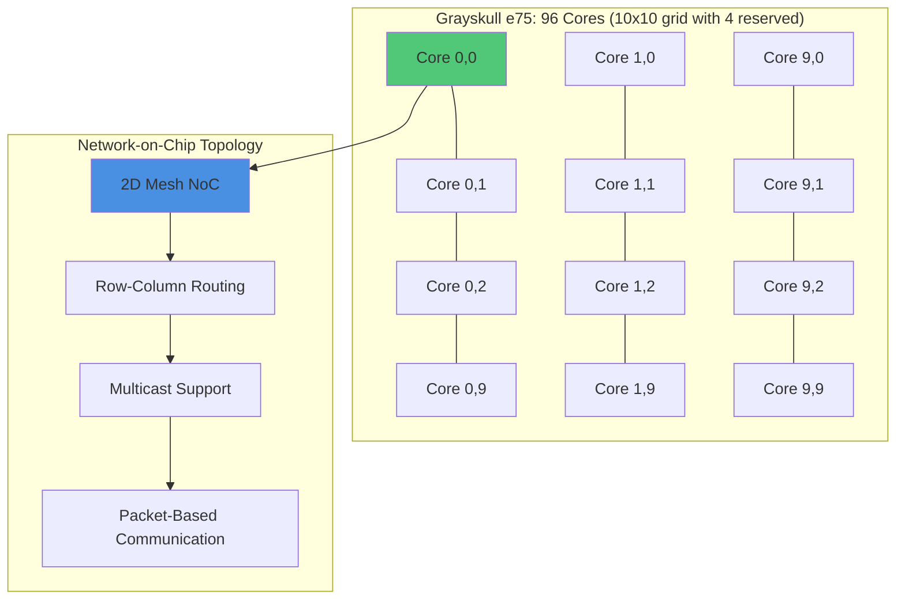

## Software Stack

### TT-Metalium Software Stack (Deprecated)

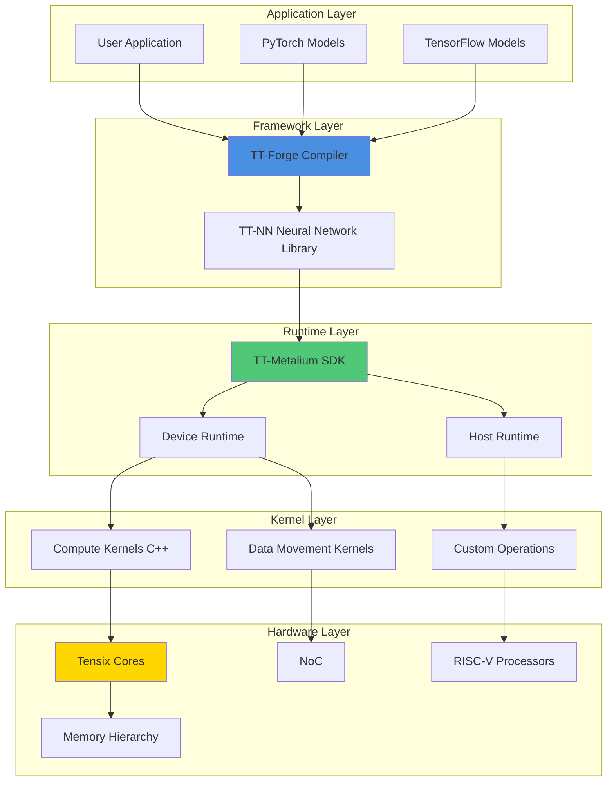

### Software Components

**Last Supported Versions (Deprecated):**
- TT-Metalium: v0.55
- TT-Buda: v0.19.3

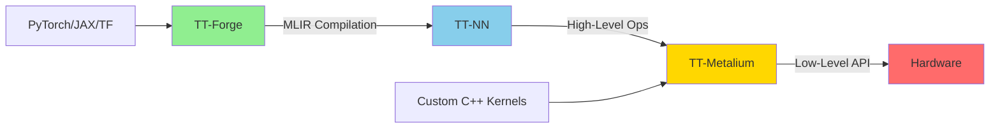

## System Integration

### PCIe Communication Flow

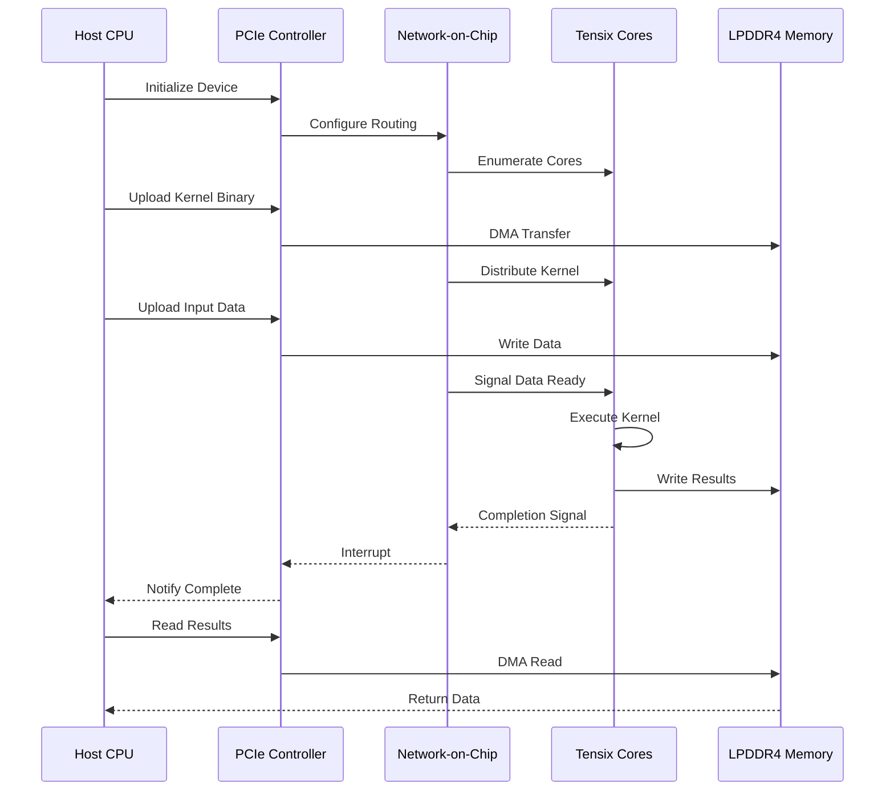

## Memory Architecture

### Memory Hierarchy

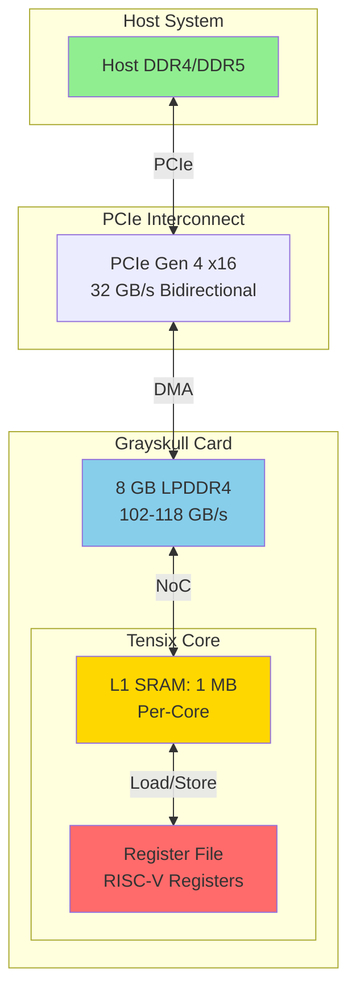

### Memory Access Patterns

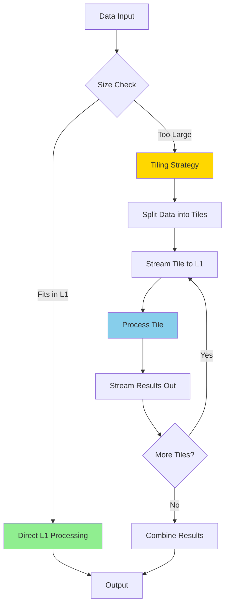

## RAID Implementation

### Reed-Solomon Coding on Tensix Cores

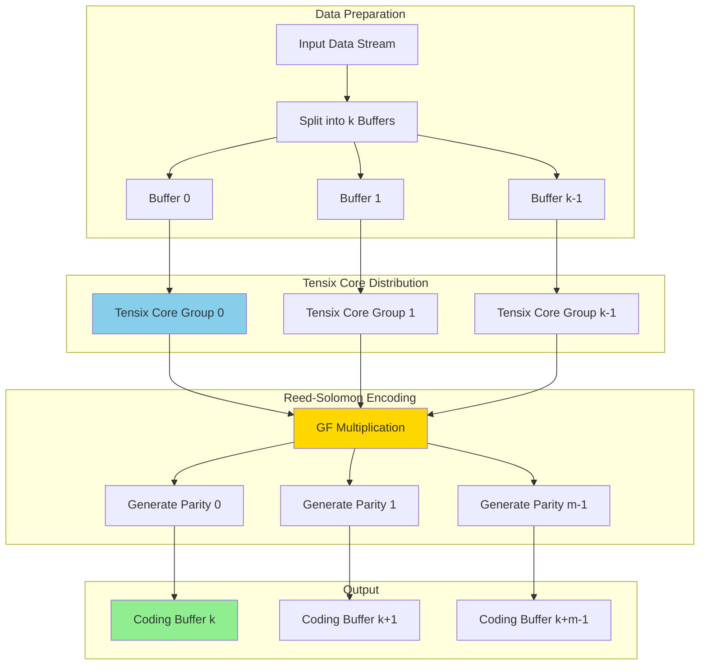

### Galois Field Operations Mapping

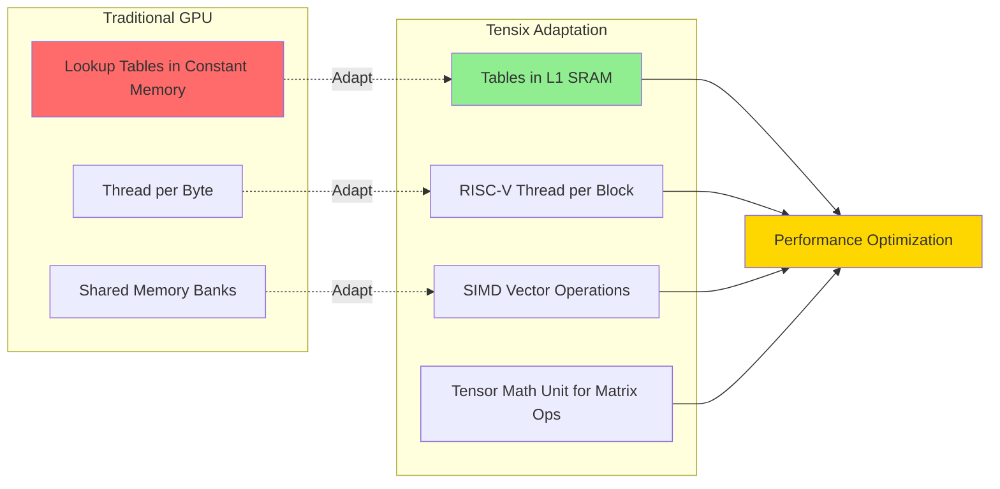

### RAID-6 Dual Parity Computation

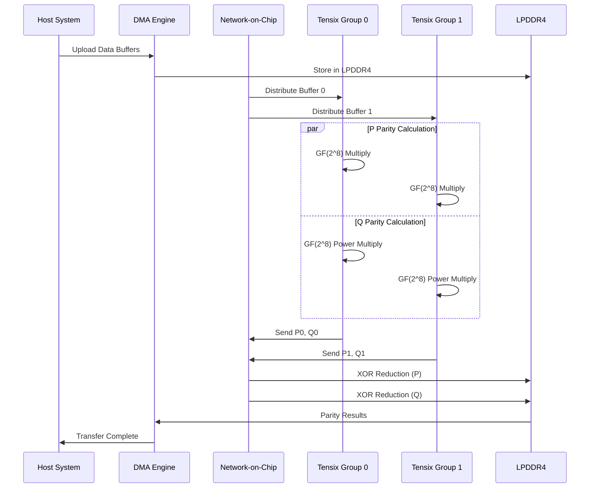

## Getting Started

### Prerequisites

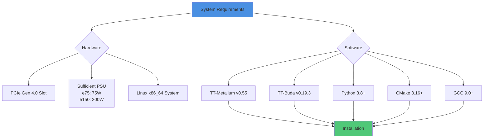

### Installation Steps

**⚠️ IMPORTANT NOTE**: Software support for Grayskull has been discontinued. The following instructions reference the last supported versions.

#### 1. Install System Dependencies

```bash
# Ubuntu/Debian
sudo apt-get update
sudo apt-get install -y \
    build-essential \
    cmake \
    git \
    python3-pip \
    python3-dev \
    libhwloc-dev \
    libyaml-cpp-dev

# Fedora/RHEL
sudo dnf install -y \
    gcc gcc-c++ \
    cmake \
    git \
    python3-pip \
    python3-devel \
    hwloc-devel \
    yaml-cpp-devel
```

#### 2. Install TT-Metalium v0.55 (Last Supported Version)

```bash
# Clone the repository (specific version)
git clone https://github.com/tenstorrent/tt-metal.git
cd tt-metal
git checkout v0.55.0  # Last supported Grayskull version

# Set environment variables
export ARCH_NAME=grayskull
export TT_METAL_HOME=$(pwd)

# Build the SDK
cmake -B build -G Ninja
cmake --build build

# Install Python bindings
pip3 install -e .
```

#### 3. Verify Hardware Detection

```bash
# List detected Grayskull devices
tt-smi

# Expected output:
# Device 0: Grayskull e75/e150
#   Cores: 96/120
#   Memory: 8 GB LPDDR4
#   Status: Ready
```

### Device Initialization Example

```cpp
#include "tt_metal/host_api.hpp"

using namespace tt::tt_metal;

int main() {
    // Enumerate devices
    int num_devices = tt::tt_metal::GetNumAvailableDevices();
    std::cout << "Found " << num_devices << " Grayskull device(s)" << std::endl;

    // Initialize first device
    Device* device = tt::tt_metal::CreateDevice(0);

    // Get device properties
    const auto& soc_desc = device->get_soc_descriptor();
    std::cout << "Device: " << soc_desc.name << std::endl;
    std::cout << "Tensix Cores: " << soc_desc.worker_grid_size.x *
                                       soc_desc.worker_grid_size.y << std::endl;
    std::cout << "DRAM Channels: " << soc_desc.dram_cores.size() << std::endl;

    // Close device
    tt::tt_metal::CloseDevice(device);

    return 0;
}
```

## Examples

### Directory Structure

```
tenstorrent_greyskull/
├── README.md                           # This file
├── docs/
│   ├── API_REFERENCE.md               # API documentation
│   ├── PERFORMANCE_GUIDE.md           # Optimization guide
│   └── MIGRATION_GUIDE.md             # GPU to Tensix migration
├── include/
│   ├── tt_graid_device.hpp            # Device management
│   ├── tt_graid_memory.hpp            # Memory operations
│   └── tt_graid_reed_solomon.hpp      # Reed-Solomon ops
├── src/
│   ├── tt_graid_device.cpp            # Device implementation
│   ├── tt_graid_memory.cpp            # Memory management
│   └── tt_graid_reed_solomon.cpp      # RS implementation
└── examples/
    ├── 01_device_enumeration.cpp      # List devices
    ├── 02_memory_transfer.cpp         # DMA examples
    ├── 03_simple_compute.cpp          # Basic kernel
    ├── 04_reed_solomon_encode.cpp     # RS encoding
    └── 05_raid_benchmark.cpp          # Performance test
```

### Quick Start Example

See `examples/01_device_enumeration.cpp` for a complete device initialization example.

### Build Examples

```bash
cd tenstorrent_greyskull
mkdir build && cd build
cmake ..
make

# Run examples
./examples/01_device_enumeration
./examples/02_memory_transfer
./examples/03_simple_compute
```

## Important Notes

### Software Support Status

⚠️ **CRITICAL**: Tenstorrent has **discontinued software support for Grayskull** hardware.

- **Last supported TT-Metalium version**: v0.55
- **Last supported TT-Buda version**: v0.19.3
- **Current development focus**: Wormhole and newer architectures

This implementation is provided for:
1. **Educational purposes**: Understanding RISC-V based AI accelerators
2. **Legacy system support**: Maintaining existing Grayskull deployments
3. **Research**: Exploring alternative accelerator architectures
4. **Archived documentation**: Preserving knowledge of this architecture

### Recommendations

- **For new projects**: Consider Tenstorrent Wormhole or other actively supported hardware
- **For existing deployments**: Pin to TT-Metalium v0.55 and TT-Buda v0.19.3
- **For development**: Use archived documentation and community resources

### Alternative Approaches

If you need current support and similar capabilities:

1. **Tenstorrent Wormhole**: Next-generation Tenstorrent hardware with active support
2. **NVIDIA GPUs**: Continue with cuSPARSELt implementation (see `/cuSPARSELt` directory)
3. **AMD MI-series**: ROCm-based alternatives
4. **Intel Habana**: Gaudi-series AI accelerators

## Architecture Comparison

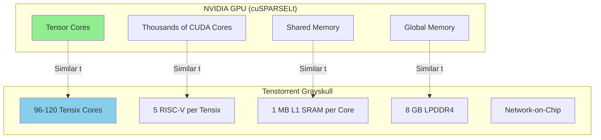

## Performance Expectations

### Theoretical Performance

| Operation | e75 | e150 | NVIDIA A100 |
|-----------|-----|------|-------------|
| FP8 TFLOPS | 221 | 332 | 624 |
| FP16 TFLOPS | 55 | 83 | 312 |
| Memory BW | 102 GB/s | 118 GB/s | 1555 GB/s |
| Power | 75W | 200W | 400W |
| TFLOPS/Watt (FP8) | 2.95 | 1.66 | 1.56 |

### RAID Operation Estimates

Based on architecture analysis and theoretical limits:

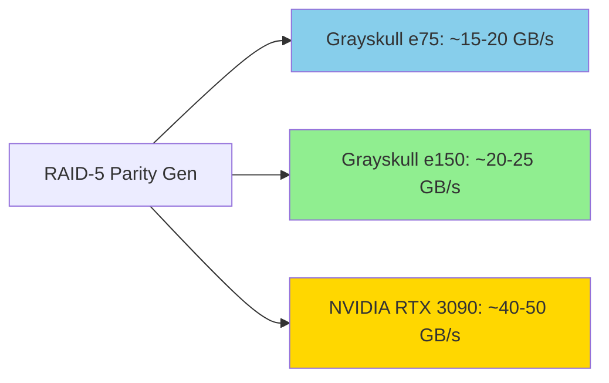

**Bottlenecks:**
- Limited LPDDR4 bandwidth vs GDDR6/HBM
- PCIe Gen 4 transfer overhead
- NoC routing latency for small operations
- RISC-V kernel compilation complexity

**Advantages:**
- Excellent power efficiency
- Deterministic performance
- Fine-grained control over compute
- Open-source software stack

## Contributing

This is a reference implementation for educational and research purposes. Contributions welcome for:

- Optimization improvements
- Documentation enhancements
- Alternative algorithm implementations
- Performance benchmarks
- Bug fixes

## License

See main repository [LICENSE](../LICENSE) file.

## References

- [Tenstorrent Official Documentation](https://docs.tenstorrent.com/)
- [TT-Metal GitHub Repository](https://github.com/tenstorrent/tt-metal)
- [Grayskull Hardware Specifications](https://docs.tenstorrent.com/aibs/grayskull/specifications.html)
- [RISC-V Specification](https://riscv.org/specifications/)
- [Reed-Solomon Error Correction](../README.md#reed-solomon-coding-for-raid)

## Support

- **Hardware**: Grayskull support discontinued - refer to archived documentation
- **Community**: [Tenstorrent Discord](https://discord.gg/tenstorrent)
- **Issues**: GitHub issues for this repository
- **Commercial**: Contact Tenstorrent for Wormhole and newer hardware

---

**Last Updated**: November 2024
**Target Hardware**: Tenstorrent Grayskull e75/e150
**Software Versions**: TT-Metalium v0.55, TT-Buda v0.19.3 (deprecated)
